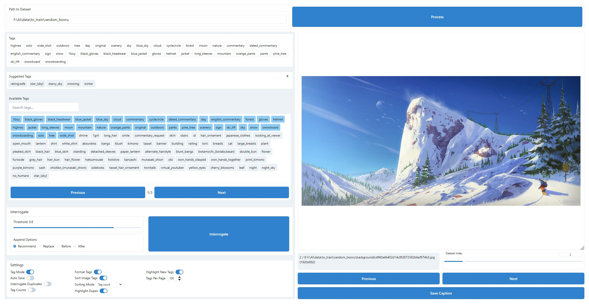
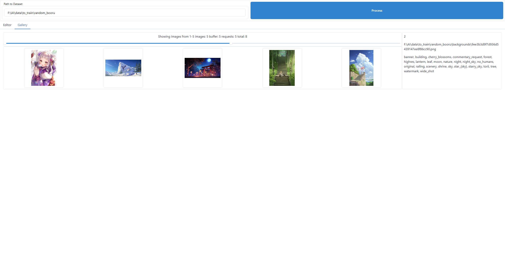

# PyWebTagger - WIP

This is a standalone dataset creation tool for stable diffusion primarily focused on using tags to describe images.





## Getting Started

You can install this program by using Git bash and the following command

```git clone https://github.com/SesuMoe/PyWebTagger.git```

Once installed run the **setup.bat** and wait for the installation to finish. 
Then use the **start.bat** and go to http://localhost:3000 in your browser.

*Note: This is meant for local usage only. Use caution if you attempt to expose the webserver to the public, 
as you may risk exposing your personal data.*

***TODO Shell***

## Usage

### Dataset

Provide the path to your dataset, and it will recursively find matching image / caption pairs (e.g. example.txt / example.png). **It does not support captions in the filename.**

### Tags

### TODO

## Goals

These are some of the long term goals I wish to achieve while working on this project.

* Booru Scrapping - Able to fetch images directly and add them to the dataset.
* Reverse-Image Tag Search - Uses a reverse image service to find and fetch tags from the internet.
* Drag and Drop - Add images to the dataset by dragging and dropping into the UI.
* ~~Interrogator - Ability to inference images to make captioning faster.~~ Done.
* Cropping - Able to crop images whether this is on another page or using the display.
* Auto-Cropping - Set and go cropping with face detection if possible.
* Bulk Tag Editor - Edit sets of tags at a time.
* ~~Gallery View - View multiple images~~ Started.
